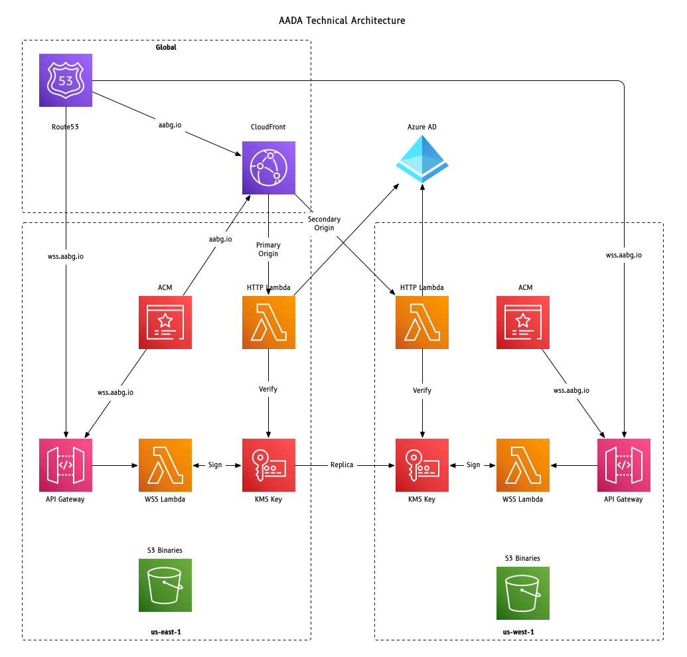

## TLDR

1. You'll want a custom build of the aada client that has the url to your company authentication
app registration.
2. Deploy the plumbing using the Terraform in the iac folder.

## High Level Deployment

A picture is worth 1000 words.

When configuring AADA for your company, a few items need to be in place.  You will need a url that
can be hosted on AWS, and be attached (via CNAME) to CloudFront.  This serves as the highly-available
endpoint for all HTTP communications.  There is also a DNS round-robin name for the WSS communications
that hit API Gateway endpoints directly.

The client itself needs effectively 3 pieces of key information:
1. Where to send a browser to initiate a sign-in when needed.  This is an
[Entra App Registration](https://learn.microsoft.com/en-us/entra/identity-platform/quickstart-register-app) 
with the correct callbacks in place.
2. The url that the successful redirect should land on.  This is your CloudFront endpoint.
3. The DNS name to locate a WSS endpoint which will be used as the callback.

## App Signing

You will probably want a developer account for Apple to sign the produced binaries unless your company
has another tool in place for whitelisting specific binaries.

Windows executables should also be signed.
