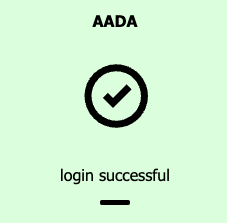
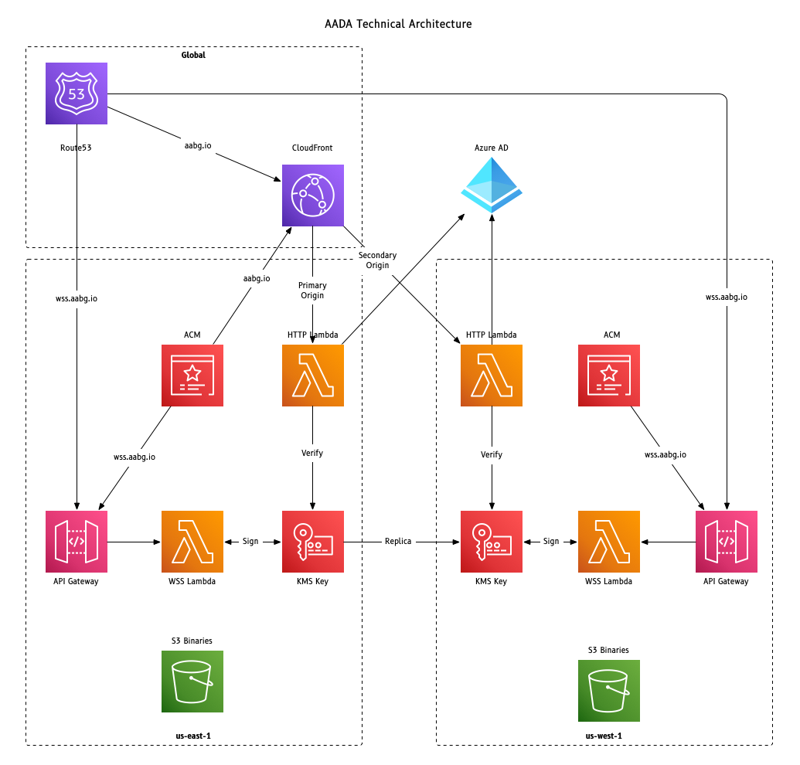

# AADA

Accenture Active Directory Authenticator

## What is this?

This is an AWS SDK credential helper that understands how to authenticate
you against the Accenture Active Directory, providing a completely seamless
authentication experience without having to enter your password or security
token.  This is useful for tools such as Terraform to more 
easily work within Accenture AWS accounts using federated credentials.

## Can I use this for my company?

Yes, and you should review the [customizing](CUSTOMIZING.md) instructions.

## How do I install it?

https://aabg.io/downloads

Download the appropriate binary and place it into your path.
There are no other system requirements.  The "aada" binary must be in
your system path for this to work properly.

## How do I use it?

Start with configuration by running `aada -configure` and aada will setup
your granted profiles into your AWS configuration.  Each profile will be
configured to automatically call aada with the correct account and group
information by any app that uses the AWS SDK.

To test it out, run trusty get-caller-identity.  On the first run, the 
aada authentication pop-through should come up, and your CLI call should
complete successfully.
```
$ aws --profile iesawsna-sandbox sts get-caller-identity
{
    "UserId": "AREXAMPLEKEYIDGOESHERE:eric.hill@accenture.com",
    "Account": "868024899531",
    "Arn": "arn:aws:sts::868024899531:assumed-role/iesawsna-sandbox/eric.hill@accenture.com"
}
```

You should see something that looks like this picture in a browser.



Once your first authentication completes, the credentials are cached in the
aws credentials file so that subsequent API calls complete without the 
authentication pop-through.  Credentials are good for an hour by default,
and with a completely transparent experience, support for longer assumption
times is not currently planned.  Please reach out with good use-cases for
longer assumption time.

## What did that just do?
1. Check for cached credentials and just return them if they're still valid
2. Initiate a cli login session using a websocket to wss.aabg.io
3. Initiate an OAuth2 authentication against the aada application, with a redirect to aabg.io/authenticator
4. The lambda on the back-end verifies the OAuth2 token and validates group membership
5. The lambda then retrieves assumed-role credentials and sends them back down the websocket to the client
6. The client caches the credentials and returns them to the SDK

## So what's required on the assumed roles?

Any role that aada needs to assume must trust `arn:aws:iam::464079168809:role/aada-trustpoint` to assume it.
Without this trust, aada cannot give you credentials.  For common shared accounts (the sandbox), this is 
already done.  For other accounts you might be using, the role may have to be updated.

Further, there is a very specific group format that aada uses.  AWS-\[AWS account number\]-\[Role name here\].  The
groups match up to the structure that ACP uses internally.  When you request credentials to one of these roles,
your membership in the Azure AD group is verified before credentials are granted.

## How is aada integrated into the aws config?

Under `~/.aws/config` you'll find profile entries for each role you have access to.

```
[profile iesawsna-sandbox]
credential_process = aada AWS-868024899531-iesawsna-sandbox
```

When you run a command that references this profile (e.g. `aws --profile iesawsna-sandbox sts get-caller-identity`),
the AWS SDK sees the `credential_process` setting and launches `aada AWS-868024899531-iesawsna-sandbox` to get
credentials.

Assuming credentials are received, they are placed into `~/.aws/credentials` for cache purposes.

```
[AWS_868024899531_iesawsna-sandbox]
aws_access_key_id     = ...
aws_secret_access_key = ...
aws_session_token     = ...
expiration_date       = 2021-06-10T15:45:28Z
```

## Simple troubleshooting
The most common error message that's been reported is `An error occurred (ExpiredToken) when calling the 
GetCallerIdentity operation: The security token included in the request is expired`.  The most likely
cause for this error is there are stale credentials in the `~/.aws/credentials` file from another tool such
as the pre-1.0 version of aada.  The easiest solution to this is simply delete the `~/.aws/credentials` file
and re-run your command.

## The Serverless Framework
The Serverless framework is available from [Serverless](https://serverless.com) and is being 
[promoted by Amazon](https://aws.amazon.com/blogs/apn/deploying-code-faster-with-serverless-framework-and-aws-service-catalog/) 
as a good starting point to deploy Lambda functions.
Getting credentials into your AWS account for Serverless to do its thing should be relatively easy, however when using
AADA, the `serverless deploy` command throws an error "AWS profile profile_name_here doesn't seem to be configured".  After
troubleshooting with [Kamorudeen Salako](mailto:kamorudeen.salako@accenture.com), we figured out that the Serverless 
framework doesn't actually load the `~/.aws/config` file like every other SDK.  Instead, it looks for the profile name
in the `~/.aws/credentials` file and fetches the credentials directly.

What does this mean for you, the bludgeoned user?  In short, AADA automatically fetches credentials and places them into
the credentials file by the fully qualified profile name.  This means that for our sandbox, the config file might show
`iesawsna-sandbox`, but the credentials file profile name is stored as `AWS_868024899531_iesawsna-sandbox`.  The important
bit here is that you will need to use `AWS_868024899531_iesawsna-sandbox` in your `serverless.yml` to call out the profile,
AND you'll have to run any command using the AWS SDK to get AADA to populate the credentials file with current keys.  Run
`aws --profile iesawsna-sandbox sts get-caller-identity` to make that happen.  The credentials will be good for an hour.

The real downside is that the Serverless framework won't call the AADA credential helper automatically like every other
AWS SDK application, so you'll have to manually run that sts command to get fresh credentials every hour.  It's not ideal
but at least it works.

## High Level Architecture


## Who do I blame when things go wrong?
This was written by Eric Hill.  Ping me on Teams and I'll see what I can do to help.

## Release information
The latest release can always be downloaded from here:
https://aabg.io/downloads

Release 1.1.2, published Jun 19, 2023 - With the recent AWS outage in
us-east-1, this version lays down the groundwork for a globally highly
available configuration.  Since state was stored in a DynamoDB table
between the websocket and http endpoints, this version instead packs
the appropriate state information into a packed structure which is
signed by KMS and sent back to the client.  The new client understands
this new structure and forwards it on to Azure AD in the state field
so it can be passed into the http endpoint.  The http endpoint uses
kms to validate the submitted state with a globally replicated kms
key.  The code to support client versions prior to 1.1.2 still remains
in place and functional for backward compatibility, however we cannot
go fully globally redundant until all clients are upgraded to 1.1.2
or later.

Release 1.0.14, published Aug 11, 2022 - Updated to use Go 1.19 and
updated dependencies for AWS SDK and other libraries to latest versions.
Added presigned url's to the downloads page.

Release 1.0.13, published July 25, 2022 - Updated to use Go 1.18.4 and
updated dependencies for AWS SDK and other libraries to latest versions.
Also added a version string to the initial frame request for server-side
troubleshooting if needed.

Release 1.0.12, unpublished - Changed the profile name in the credentials
file to include a _cache suffix to try and eliminate an annoying bug
where an application tries to shortcut the credential process by looking
directly in the credentials file.  Having found credentials, the app
tries to use them without checking the expiration date and errors.  You
either have to manually refresh the creds (sts get-caller-identity for
example), or delete the credentials so the problematic application will
just do it the right way and stop shortcutting things.  This change WILL
LIKELY BREAK the serverless framework since it looks in credentials
directly.  As such, this build is unpublished until I figure out a way
to be compatible with some of these problematic applications.

Release 1.0.11, published May 13, 2022 - Updated to use Go 1.18.2.
Corrected Mage build system to use generic aada.exe or aada names
inside zip files instead of the interim build executable names.  This
caused some confusion on Windows platforms when the binary in the zip
was aada_win_x64.exe, and really just should have been aada.exe.

Release 1.0.10, published Apr 15, 2022 - Updated to use Go 1.18.1 and
to use the Mage build system instead of Makefile.  Mage now includes a
release to help with uploading releases to GitHub.

Release 1.0.9, internal build, unreleased.

Release 1.0.8, published Jan 5, 2022 - Updated to use Go 1.17.5. No other
changes.

Release 1.0.7, published September 22, 2021 - Updated to use Go 1.17.1.
Added a new -long-profile-names switch, so that profiles with similar
names (Admin) will actually be named 012345_Admin and 67890_Admin instead
of Admin and Admin2.  You can obviously change the profile names to your
liking as well (e.g. ClientName_Admin) since AADA doesn't really care
what the profile name actually is.

Release 1.0.6, published August 31, 2021 - Updated to use Go 1.17 which
should give a tiny speed boost and cut roughly 10% from the total binary
size.  No additional features, and upgrading from 1.0.5 is purely optional.

Release 1.0.5, published August 13, 2021 - Added the ability to deal with
both `-configure` AND `--configure` since that seems to be the #1 reason
people have issues getting aada to work.  Also added another switch to
launch the AWS Console interface (https://aabg.io/awsconsole), so in your
terminal you can type `aada -console` and it will open that url for you.

Release 1.0.4, published July 22, 2021 - Added simple check for missing
expiration date in credentials file to force new credentials to be fetched.
This solves the common issue of stale (older) credentials from prior
versions of aada or aaca.  Deleting the credentials file accomplishes the
same results, just with more effort.  Also changed the build mechanism to
deliver all of the binaries inside platform and architecture specific zip
files.  The linux arm32 files work on Raspberry Pi systems running against
the ARM v7 architecture.  The linux arm64 work on ARM v8 or later.

Release 1.0.3, published July 19, 2021 - First non-beta release of Mac
M1 build.  Better error handling, invalid switch detection, and proper
usage display for help.

Release 1.0.2, published July 14, 2021 - Non-beta release functionally
equivalent to 1.0.1-beta.  Now with a pretty usage screen.

Release 1.0.1-beta, published July 6, 2021 - A few minor tweaks and the
addition of full autoconfiguration, assuming `aada` is in your path.

Release 1.0.0-beta, published June 9, 2021 - Complete overhaul and
refactor to use OAuth2 as a trusted Azure AD application.  This version
is 100% different, and not backward compatible with prior versions.  It
requires a custom trust on the assumed role, but with that trust, buys
a completely seamless CLI authentication experience.

Release 0.1.8, published March 15, 2021 - New builds with Go version
1.16.2.

Release 0.1.7, published Feb 26, 2021 - New builds with Go version 1.16.0
to fix the false-positive hueristic virus detection by Cylance and
Microsoft Defender (Program.Win32/Wacapew.C!ml).  To be clear, the
previous version had no virus in it.  This version is actually throwing
a false positive for TrojanSpy.MSIL.bgkz with the Jiangmin scanner, but
Defender is now happy.  I'll try to run these through VirusTotal from
now on to make sure we don't have any more false positives.

Release 0.1.6, published Feb 22, 2021 - Added the ability for AADA to
automatically create the .aws folder if it doesn't already exist.

Release 0.1.5, published Jan 19, 2021 - Added the ability for AADA to
automatically create config and credentials files if they do not already
exist.  Additionally, the aada Mac binary has been signed with an Apple
developer certificate to comply with the new Mac signature requirements.
The signed binary is in binaries/mac/aada, and has also been zipped into
binaries/mac/aada.zip for your convenience.

Release 0.1.4, published Jan 12, 2021 - No new features.  New Go compiler
producing a slightly better binary and refreshed dependencies.  Not a
required upgrade.

Initial release 0.1.3, published May 12, 2020.
